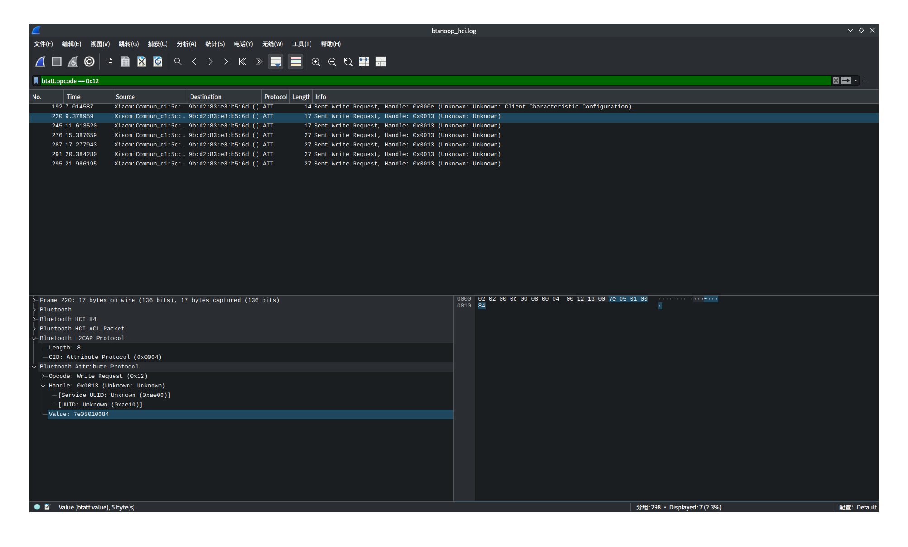

# Android - BLE 逆向入门：从 HCI 日志到 Wireshark 分析

## 前言

想搞清楚一个蓝牙设备是怎么被手机 APP 控制的？其实没那么神秘。很多时候，我们只需要把手机和耳机（或手环、手表）之间“悄悄话”录下来，就能看懂它们交流的规则。

这篇笔记记录了一个最简单的实操过程：不用复杂的 Root 操作，直接利用 Android 自带的开发者模式，把蓝牙底层数据包（HCI Log）导出来，再扔进 Wireshark 里一分析，APP 发送的每一个指令（比如播放、暂停、调音量）都无所遁形。

## 手机端：开启日志与导出

首先，我们需要让手机开始“录音”。

1.  **开启开发者模式**：
    *   进入 `设置` -> `关于手机`，连续点击 `版本号` 直到提示开启成功。
2.  **打开蓝牙 HCI 日志**：
    *   进入 `设置` -> `系统` -> `开发者选项`。
    *   找到并勾选 **“启用蓝牙 HCI 信息收集日志”**。
    *   关闭再开启蓝牙，使日志生效
3.  **复现操作**：
    *   打开目标 APP，连接设备。
    *   执行你想要分析的动作（例如点击播放按钮）。
4.  **导出日志**：
    *   操作完成后，日志文件位于：`/data/misc/bluetooth/logs/btsnoop_hci.log`。
    *   通过 ADB 导出到电脑：
        ```bash
        adb pull /data/misc/bluetooth/logs/btsnoop_hci.log
        ```

## Wireshark：过滤与分析

将导出的 `.log` 文件拖入 Wireshark。面对密密麻麻的数据包，我们需要用过滤器来“划重点”。

### 1. 锁定关键流量
在顶部的过滤栏输入以下指令，直接筛选出所有的 **写请求（Write Request）** 数据包：

```text
btatt.opcode == 0x12
```
*(注：`0x12` 代表 ATT Write Request，即手机向设备写入数据的操作)*

### 2. 解读数据包
过滤后，列表会清爽很多。选中其中一行，查看下方的详情面板：

*   **定位特征值**：在 `Bluetooth Attribute Protocol` 层级下，找到 `Handle`（句柄），例如图中的 `0x0013`。这通常对应设备端的某个控制特征值。
*   **查看指令内容**：展开 `Value` 字段，这里就是 APP 发送给设备的真实指令数据。



**实例分析：**
如上图所示，我们捕获到了针对 `Handle: 0x0013` 的一系列写入操作。观察 `Value` 的变化（例如 `7e 05 01 00 84` 等），对比你在 APP 上的操作（暂停、播放、音量加减），就能轻松破解出每个字节代表的含义，从而实现对设备的自定义控制。