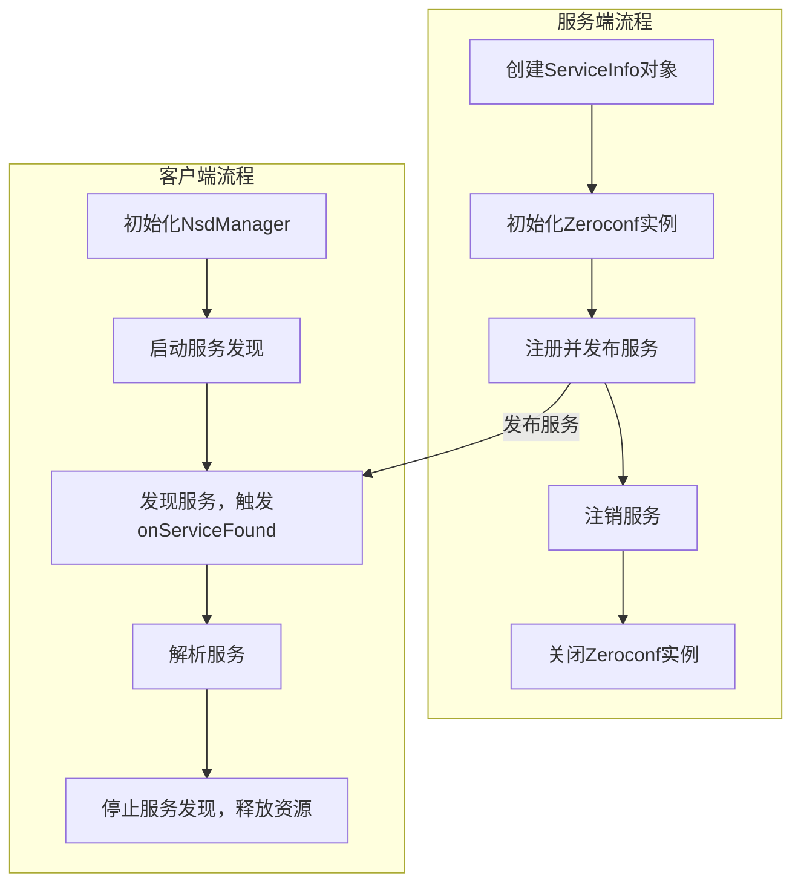

# NSD 服务发现

## 流程



## 服务端

zeroconf 库是 Python 中实现 mDNS/DNS-SD 的常用工具，可以通过 ServiceInfo 设置 TXT 记录

```Python
from zeroconf import Zeroconf, ServiceInfo
import socket

# 准备服务属性 (TXT记录)
properties = {
    b'version': b'1.2.3',
    b'user': b'Alice',
    b'mode': b'debug'
}

# 创建ServiceInfo对象
service_info = ServiceInfo(
    type_="_test._tcp.local.",        # 服务类型，必须与Android端发现类型匹配
    name="MyService._test._tcp.local.", # 服务实例名称
    addresses=[socket.inet_aton('0.0.0.0')],    # 传入二进制IP地址的列表
    port=8080,                         # 服务端口
    weight=0,
    priority=0,
    properties=properties,             # 对应Android端的Attributes
    server="myhost.local."             # 主机名
)

# 注册并发布服务
zeroconf = Zeroconf()
try:
    zeroconf.register_service(service_info)
    print("服务已发布")
    input("按回车键退出...\n") # 保持程序运行
finally:
    zeroconf.unregister_service(service_info)
    zeroconf.close()
```

## 客户端

```Java
public class HomeAssistantSearcher implements NsdManager.DiscoveryListener, DefaultLifecycleObserver {

    private static final String SERVICE_TYPE = "_test._tcp.";
    private static final String TAG = "HomeAssistantSearcher";

    private static final ReentrantLock lock = new ReentrantLock();

    private final NsdManager nsdManager;
    private final WifiManager wifiManager;
    private final ValueCallback<String> valueCallback;

    private boolean isSearching = false;
    private WifiManager.MulticastLock multicastLock = null;

    public HomeAssistantSearcher(NsdManager nsdManager, WifiManager wifiManager, ValueCallback<String> valueCallback) {
        this.nsdManager = nsdManager;
        this.wifiManager = wifiManager;
        this.valueCallback = valueCallback;
    }

    private void beginSearch() {
        if (isSearching) {
            return;
        }
        isSearching = true;
        try {
            nsdManager.discoverServices(SERVICE_TYPE, NsdManager.PROTOCOL_DNS_SD, this);
        } catch (Exception e) {
            Timber.e(e, "Issue starting discover.");
            isSearching = false;
            return;
        }

        try {
            if (wifiManager != null && multicastLock == null) {
                multicastLock = wifiManager.createMulticastLock(TAG);
                multicastLock.setReferenceCounted(true);
                multicastLock.acquire();
            }
        } catch (Exception e) {
            Timber.e(e, "Issue acquiring multicast lock");
            // Discovery might still work so continue
        }
    }

    // Stop search
    public void stopSearch() {
        if (!isSearching) {
            return;
        }
        isSearching = false;
        try {
            nsdManager.stopServiceDiscovery(this);
            if (multicastLock != null) {
                multicastLock.release();
                multicastLock = null;
            }
        } catch (Exception e) {
            Timber.e(e, "Issue stopping discovery");
        }
    }

    @Override
    public void onResume(LifecycleOwner owner) {
        beginSearch();
    }

    @Override
    public void onPause(LifecycleOwner owner) {
        stopSearch();
    }

    @Override
    public void onDiscoveryStarted(String regType) {
        Timber.d("Service discovery started");
    }

    @Override
    public void onServiceFound(NsdServiceInfo foundService) {
        Timber.i("Service discovery found: %s", foundService);
        lock.lock();
        nsdManager.resolveService(
            foundService,
            new NsdManager.ResolveListener() {
                @Override
                public void onResolveFailed(NsdServiceInfo failedService, int errorCode) {
                    Timber.w("Failed to resolve service: %s, error: %d", failedService, errorCode);
                    lock.unlock();
                }

                @Override
                public void onServiceResolved(NsdServiceInfo resolvedService) {
                    Timber.i("Service resolved: %s", resolvedService);
                    if (resolvedService != null && resolvedService.getHost() != null) {
                        Map<String, byte[]> attributes = resolvedService.getAttributes();
                        valueCallback.onReceiveValue(resolvedService.toString().replace(", ", "\n"));
                        byte[] baseUrl = attributes.get("base_url");
                        byte[] versionAttr = attributes.get("version");
                        if (baseUrl != null && versionAttr != null) {

                        }
                    }
                    lock.unlock();
                }
            }
        );
    }

    @Override
    public void onServiceLost(NsdServiceInfo service) {
        Timber.e("service lost: %s", service);
    }

    @Override
    public void onDiscoveryStopped(String serviceType) {
        Timber.i("Discovery stopped: %s", serviceType);
    }

    @Override
    public void onStartDiscoveryFailed(String serviceType, int errorCode) {
        Timber.e("Discovery failed: Error code:%d", errorCode);
        stopSearch();
    }

    @Override
    public void onStopDiscoveryFailed(String serviceType, int errorCode) {
        Timber.e("Discovery failed: Error code:%d", errorCode);
        stopSearch();
    }
}
```

## 参考资料

- [Android NSD 官方文档](https://developer.android.com/reference/android/net/nsd/NsdManager)
- [DNS-SD 协议介绍](https://en.wikipedia.org/wiki/Zero-configuration_networking)
