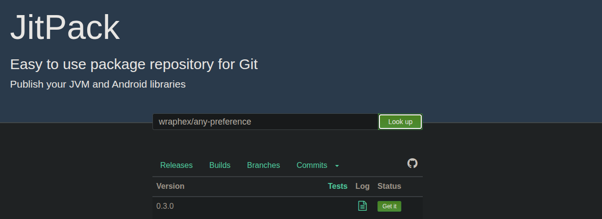
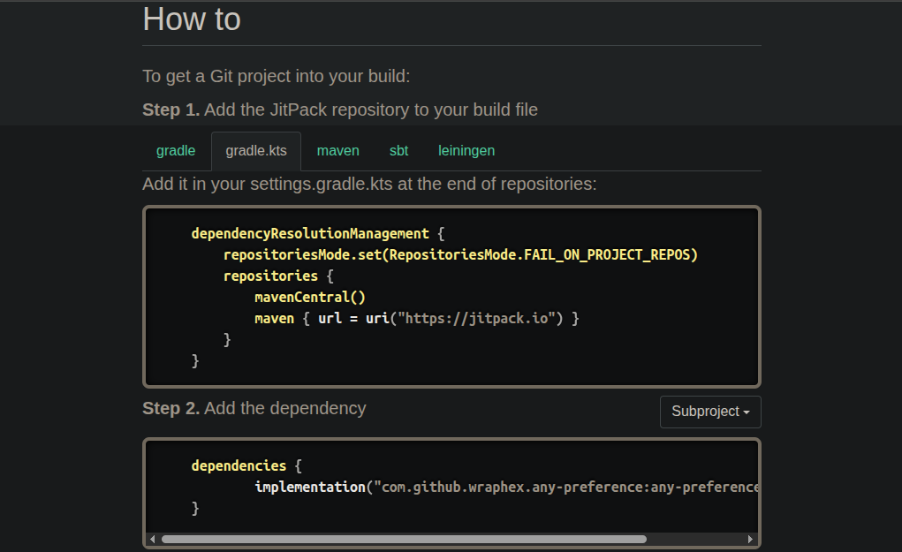

# 快速上手 JitPack：零成本发布 Android 开源库

## 前言

JitPack可以让你非常方便地从GitHub等平台上的开源项目直接构建和发布依赖库（如 AAR 文件）。它极大地简化了发布流程，让开发者能够专注于代码本身，而不是繁琐的构建和上传过程。

## 配置maven

jitpack依赖maven-publish插件进行发布，需要先配置maven。以下代码均在需要发布的模块的`build.gradle.kts`中添加或修改：

1. 添加maven-publish插件
	```kts
	plugins {
		...
	    id("maven-publish")
	}
	```

2. 在android块内添加publishing块
	```kts
	android {
		...
		// 一般的项目都有release变体，如果配置了多渠道，需要改成对应的渠道，下面会介绍
		publishing {
		    singleVariant("release")
		}
	}
	```

3. 配置publishing
	jitpack编译时会执行类似代码传入group和version字段：
	```bash
	./gradlew clean -Pgroup=com.your.domain -Pversion=1.0 -xtest -xlint assemble publishToMavenLocal
	```
	比如github的仓库就是`-Pgroup=com.github.xxx -Pversion=1.0`，version为release版本号或commitId
	下面读取jitpack编译工具传入的字段进行配置：
	```kts
	afterEvaluate {
	    publishing {
	        val pubGroup = project.findProperty("group")?.toString() ?: "com.your.domain"
	        val pubVersion = project.findProperty("version")?.toString() ?: "SNAPSHOT"
	        publications {
	            register<MavenPublication>("release") {
	                groupId = pubGroup
	                artifactId = "your-artifactId"
	                version = pubVersion
	                from(components["release"])
	            }
	        }
	    }
	}
	```
	> 最终产物会被命名为`groupId:artifactId:version`

## 发布前检查

正式在jitpack发布前，建议先在本地运行maven发布脚本检查：

```bash
./gradlew publishToMavenLocal
```

产物会被放到`$HOME/.m2/repository`，打开对应目录查看是否正常，如果能找到aar文件，且aar符合预期，就可以正式发布了

## 正式发布

打开[JitPack官网](https://jitpack.io/)，输入`用户名/仓库名`，点击`Look up`，下方就会列出对应仓库的版本信息



选择你要编译的版本，点`Get it`触发编译

编译完成后，下方会列出这个包的引用方式



至此，发布完成。详细配置可以参考 https://github.com/wraphex/any-preference

## 多渠道（Flavor）发布

```kts
android {
	...
    flavorDimensions += "dimension1"
    productFlavors {
        create("flavor1") {
            dimension = "dimension1"
        }
        create("flavor2") {
            dimension = "dimension1"
        }
    }
	
    publishing {
        singleVariant("flavor1Release")
        singleVariant("flavor2Release")
    }
}

afterEvaluate {
    publishing {
        val pubGroup = project.findProperty("group")?.toString() ?: "com.github.wraphex"
        val pubVersion = project.findProperty("version")?.toString() ?: "SNAPSHOT"
        publications {
            register<MavenPublication>("flavor1Release") {
                groupId = pubGroup
                artifactId = "your-artifactId"
                version = pubVersion
                from(components["flavor1Release"])
            }
            register<MavenPublication>("flavor2Release") {
                groupId = pubGroup
                artifactId = "your-artifactId"
                version = pubVersion
                from(components["flavor2Release"])
            }
        }
    }
}
```

## 参考

https://docs.jitpack.io/android/

https://github.com/wraphex/any-preference
