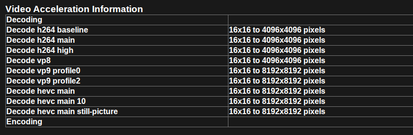
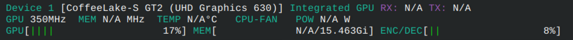

# ArchLinux - 显卡配置

## Intel显卡

### VA-API

> [视频加速API (Video Acceleration API, 缩写为VA-API)](https://en.wikipedia.org/wiki/Video_Acceleration_API "wikipedia:Video Acceleration API") 是一套 Intel 提供的视频硬件编解码的开源库和标准。
> 
> [https://wiki.archlinuxcn.org/wiki/硬件视频加速#VA-API](https://wiki.archlinuxcn.org/wiki/%E7%A1%AC%E4%BB%B6%E8%A7%86%E9%A2%91%E5%8A%A0%E9%80%9F#VA-API)
> - [Broadwell](https://github.com/intel/media-driver/#supported-platforms) [(~2014)](https://en.wikipedia.org/wiki/Template:Intel_processor_roadmap "wikipedia:Template:Intel processor roadmap") 及之后的 HD Graphics 系列（例如英特尔 Arc 系列显卡），请使用 [intel-media-driver](https://archlinux.org/packages/?name=intel-media-driver)包 。
> - GMA 4500 (2008) 到 [Coffee Lake](https://en.wikipedia.org/wiki/Coffee_Lake "wikipedia:Coffee Lake") (2017) 的 GPU, 请使用 [libva-intel-driver](https://archlinux.org/packages/?name=libva-intel-driver)包 。

检查API
```bash
paru -S libva-utils
vainfo
```

## Nvidia显卡

[显卡代号查询](https://nouveau.freedesktop.org/CodeNames.html)

### 安装闭源显卡驱动（Pascal及以下）

NVIDIA 590版本开源驱动[已经放弃了Pascal及以下nvidia显卡的支持](https://archlinux.org/news/nvidia-590-driver-drops-pascal-support-main-packages-switch-to-open-kernel-modules/)，nvidia包已替换为nvidia-open，所以对于Pascal及以下nvidia显卡，需要转为[安装nvidia-580xx-dkms](https://wiki.archlinux.org/title/NVIDIA#Installation)

```bash
paru -S linux-headers nvidia-580xx-dkms nvidia-580xx-utils
```

## Chromium VA-API解码

> 最新版Chromium默认配置已经可以正常硬件加速（VA-API），配置好VA-API即可，如果仍未正常，尝试下方配置

### wayland配置

```bash
--ozone-platform-hint=wayland --enable-wayland-ime --ozone-platform=wayland
```

### 开启硬件解码

```bash
--enable-features=AcceleratedVideoDecodeLinuxGL
```

### 验证

1. API验证
	Chromium打开`chrome://gpu/`，页面下方会列出支持的视频加速信息
	
2. 视频播放验证
	安装运行`nvtop`，播放视频同时看nvtop中是否有GPU的ENC/DEC占用
	

## ObsStudio QSV编码

QSV的编解码性能比VA-API好，Obs也对QSV编码做了支持，使用QSV编码可以获得良好的性能。

1. Obs设置 - 输出 - 录制 - 视频编码器 - 选择带QSV的硬件编码器
2. 开始录制
3. 如果出现异常，则可能需要安装依赖：[Intel 视频处理库 (Intel VPL)](https://wiki.archlinuxcn.org/wiki/%E7%A1%AC%E4%BB%B6%E8%A7%86%E9%A2%91%E5%8A%A0%E9%80%9F#Intel_%E8%A7%86%E9%A2%91%E5%A4%84%E7%90%86%E5%BA%93_\(Intel_VPL\))
	> 对于 [Intel VPL](https://github.com/intel/libvpl) ，请[安装](https://wiki.archlinuxcn.org/wiki/%E5%AE%89%E8%A3%85 "安装")基础库 [libvpl](https://archlinux.org/packages/?name=libvpl)包 ，并确保安装下列之一的运行时环境：
	> - [vpl-gpu-rt](https://archlinux.org/packages/?name=vpl-gpu-rt)包 ：为 Tiger Lake 和更新的GPU提供支持
	> - [intel-media-sdk](https://archlinux.org/packages/?name=intel-media-sdk)包 (已终止后续支持)：为旧 Intel GPU 提供支持
