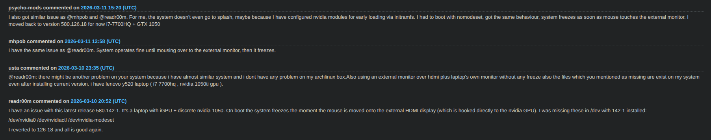

# ArchLinux - 记一次Arch滚挂救活过程

## 前言

今天重启进入sddm，输入密码，回车，啪，卡住了，重启，还是一样

## 分析一波

卡住时发生了啥？

等待硬盘IO？硬盘灯没闪，说明IO正常（就算是等待IO也不至于整个系统卡住），pass；

CPU跑满了？CPU风扇没转，CPU也正常，pass；

`Ctrl` + `Alt` + `F3` 切到TTY，无反应，系统崩了？

桌面进不去，那就只能强制重启，sddm界面切进TTY

看下上一次启动周期的[系统日志](技巧#查看系统日志)

```bash
journalctl -b -1
```

找到两行可疑报错（解释来自AI）：

- `BUG: kernel NULL pointer dereference, address: 0000000000000028`：这是典型的空指针解引用错误，意味着内核试图访问无效的内存地址。
- `Invalid framebuffer status: GL_FRAMEBUFFER_INCOMPLETE_MISSING_ATTACHMENT`：这是一个 OpenGL/图形相关的错误，表明帧缓冲区设置不完整，缺少必要的附件（通常是颜色缓冲或深度缓冲）。

基本上锁定是新版的内核或显卡驱动出问题了

[切换](更换内核)lts内核验证，虽然能进入桌面，但检测不到外置显示器，看来还是显卡驱动问题

显卡驱动导致的内核崩溃，升级了显卡驱动导致的？找pacman日志 `/var/log/pacman.log` 确认：

```
...
... upgraded nvidia-580xx-dkms (580.126.18-2 -> 580.142-1)
...
```

最后到[AUR评论区](https://aur.archlinux.org/packages/nvidia-580xx-dkms)检查，果然



## 救活

目前这个显卡驱动的维护者还没更新修复的新版本，先降级到前一个版本，参考[安装指定版本AUR包](包管理#安装指定版本AUR包)
