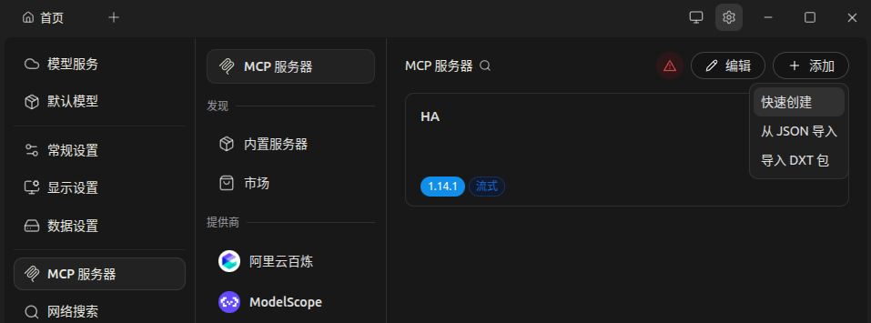
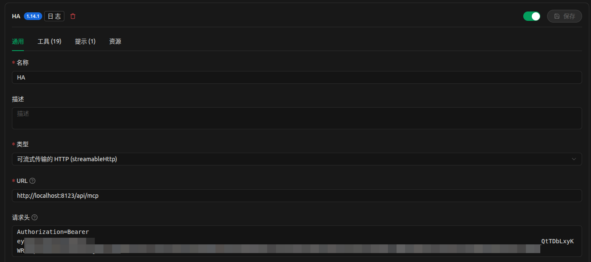
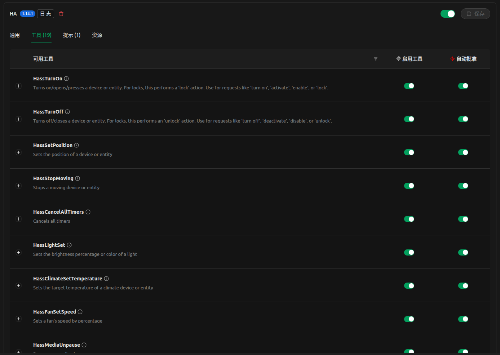
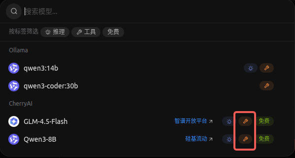
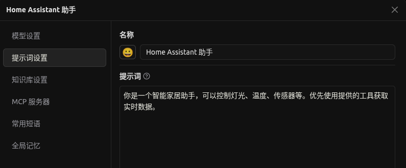
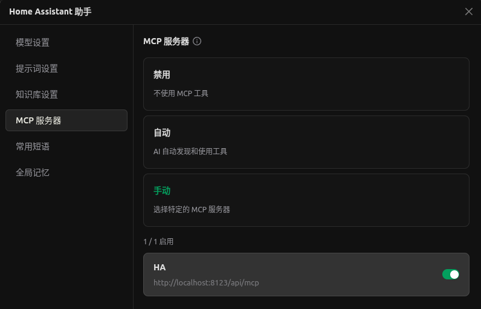
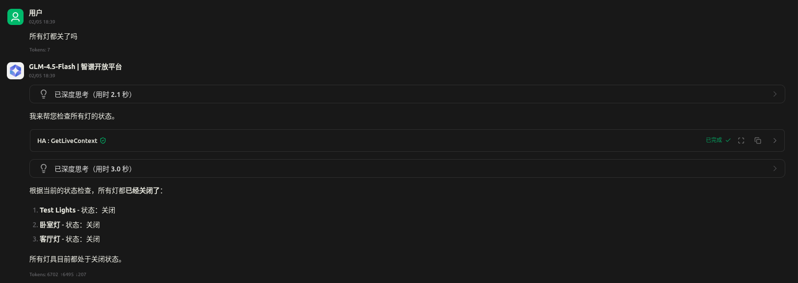
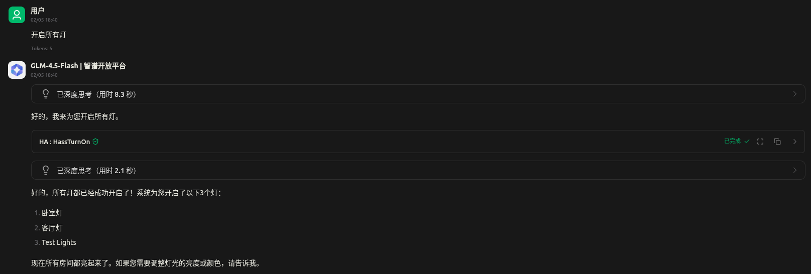

# HomeAssistant通过MCP接入AI客户端

## HA启用MCP Server

`设置` - `添加集成` - 搜索安装`Model Context Protocol Server`

浏览器访问 `{HA地址}/api/mcp` 如果返回`401: Unauthorized`，说明启用成功

## 配置AI客户端（MCP Client）

需要使用支持MCP的客户端，这是支持的客户端列表： https://modelcontextprotocol.io/clients ，下面以其中的Cherry Studio为例进行配置

1. 右上角 `设置` - `MCP服务器` - `添加` - `快速创建`

2. 填写配置

名称：随便写，能辨认是HA就行

类型：可流式传输的HTTP

URL：`{HA地址}/api/mcp`

请求头： `Authorization=Bearer {HA令牌}`

填写后点右上角保存，启用。启用成功后就会获取到HA MCP Server提供的工具了

3. 添加助手

回到主界面添加助手

模型设置：选择支持工具调用的模型

提示词设置：提示词可以自己写，比如这里的 `你是一个智能家居助手，可以控制灯光、空调等智能设备，也可以获取温湿度等传感器数据。优先使用提供的工具获取实时数据。`

MCP服务器：选择手动，并启用刚刚添加的配置

4. Enjoy!

获取设备状态

控制设备

## 参考

https://modelcontextprotocol.io/docs/getting-started/intro

https://www.home-assistant.io/integrations/mcp_server

https://modelcontextprotocol.io/clients

https://docs.cherry-ai.com/advanced-basic/mcp/config