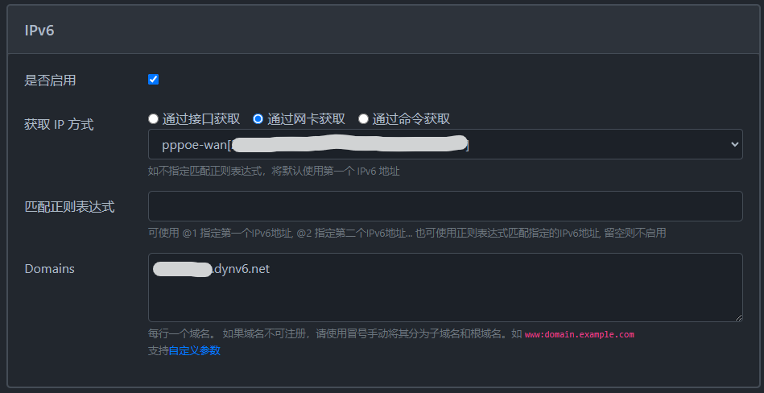

# OpenWRT - 配置DDNS-GO自动更新dynv6的ipv6记录

## 安装DDNS-GO

```bash
opkg update
opkg install ddns-go luci-app-ddns-go luci-i18n-ddns-go-zh-cn
```

安装后可在openwrt后台 `服务`→`DDNS-GO` 找到管理入口

## 获取设备ipv6地址

本机（路由器）的地址可以直接通过网卡获取



其他设备（连接路由器的设备）可以通过命令获取，这里使用[路由表获取](https://github.com/jeessy2/ddns-go/wiki/通过命令获取IP参考#获取局域网中的其它设备ipv6地址)

```bash
ip -6 addr show br-lan | awk '{print $2}' | awk '/240:?/' | awk -F:: '{print $1 ":xxxx:xxx:xxxx:xxxx "}'
```

## dynv6域名设置

进入[dynv6](https://dynv6.com/zones)设置/新建域名

## 形成Update API

参考[API文档](https://dynv6.com/docs/apis#http)形成下方格式的http请求网址，token在文档中已给出

```
http://dynv6.com/api/update?hostname=#{domain}&token=你的token&ipv6=#{ip}
```


## webhook通知

配置webhook通知，在ip地址发生变化时发送通知

