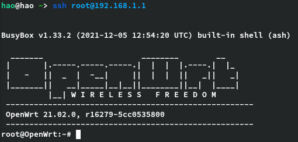

# 拿什么拯救你，我的校园网——校园网优化之单线多拨

> 大学人苦校园网久矣！你是否被校园网那几百KB/s的限速所困扰？你有没有过让校园网网速翻倍的想法？这篇文章能帮到你！（多图预警）
> 

## 准备材料

- 一台路由器（OpenWrt固件）
- 电脑（手机也可）
- 校园网

## 准备工作

- 确保路由器能联网
- 电脑进入OpenWrt后台网页
- 一定的耐心和计算机网络知识(bushi

## 废话少说，马上开搞！

首先确保你的电脑连接到路由器，路由器连接到校园网

然后打开终端，ssh进入路由器后台



### 添加虚拟网卡

安装macvlan

```bash
opkg update
opkg install kmod-macvlan
```

创建并启用虚拟网卡

```bash
ip link add link eth0.2 name veth0 type macvlan 
ifconfig veth0 up # 启用创建的veth0网卡
```

其中，eth0.2是我网络接口中对应的的物理网卡，启用了VLAN的固件一般是eth0.x，至于x是几根据VLAN划分确定。可以直接到网络→接口查看


以上方法是临时创建的虚拟网卡，重启后虚拟网卡失效，创建永久虚拟网卡可以用下面的方法：

```bash
vi /etc/config/network

# 添加内容
config device 'veth0'
    option name 'veth0'
    option ifname 'eth0.2'
    option type 'macvlan'
```

这时输入`ifconfig`检查是否添加成功：

```bash
ifconfig
...
veth0     Link encap:Ethernet ... # 列表中有我们刚刚创建的veth0网卡，参数正常，创建成功
...
```

### 创建接口

进入OpenWrt网页后台，点击网络→接口

建议先把已经绑定到上面eth0.2的wan口删除或者设为开机时不启动，避免虚拟网卡获取不到IP地址


添加新接口，设备选择虚拟网卡veth0，然后创建接口。


设置网关跃点，随便一个值，但不要和其他wan口重复。


防火墙选择wan


其他设置保持默认，保存应用。

检查IP是否正常获取


IP地址与校园网自助服务系统的IP是对应的，说明已经成功通过虚拟网卡连接到校园网

然后登陆校园网，检查网络是否正常（每个学校的登陆方式不同，这里省略一张截图）

再创建一个接口

按同样的方法再创建一个虚拟网卡vwan2。这时vwan2还未连上校园网，只是自动获取了IP地址


这里要注意的是我们的vwan2并不是创建后马上被使用，这时候进入校园网登陆界面仍显示已登陆，因为现在的流量走的是vwan1

## 负载均衡

那怎么让流量走vwan2，从而让vwan2登上校园网呢？

这时候就要用到负载均衡插件mwan3了

```bash
opkg install mwan3 luci-app-mwan3
```

安装完后到网络→负载均衡界面，把接口、成员、策略、规则里面的配置全部删掉

在接口里面新增vwan1，名字要和在网络→接口添加的接口名相同，否则无法匹配接口

勾选启用，填入跟踪的IP，接口会ping这个IP检查自己是否在线。其他配置保持默认就行


再添加一个vwan，保存，回到接口，可以看到像这样的配置


需要特别注意的是，跃点数是不是数值，显示“-”要么是接口的跃点数没指定，回到网络→接口重新指定，要么是填的接口名称不对应。还有不同接口间的跃点数是否不同

### 成员配置


名称建议用“接口_跃点数_权重”，方便配置策略时分辨

路由优先发往跃点值较小的接口。跃点值相同的接口，按权重走路由。如果你用的是同一个号，网速相同，推荐相同跃点数，权重1:1，自行斟酌就ok

### 策略配置


添加一个平衡策略balanced，把前面的所有成员添加进来，再添加vwan1、vwan2单独的策略，一个策略对应一个接口，单独策略在后面登陆校园网很有用

### 规则配置


重头戏来了，这一步实现指定用哪一个接口登陆校园网，也就是上图中的login_net规则

目标地址填校园网网页登陆的地址，协议all，最后分配的策略选单独策略，这样就能控制登陆校园网的流量全部走分配给它的接口。每个单独策略都选一次保存应用然后登陆，有多少个vwan口就要登多少次

### 最后检查

登陆之后检查所有接口是否都在线，状态→负载均衡


切换到详细信息，检查策略是否分配正确


我后面多加了一个vwan3口，所以负载均衡平均下来是每个口33%的流量。

两个口的情况应该是每个口50%，分配的配置不同这里显示的也不同。

## 测速

至此，理论上已经实现了多拨，多线的网速会翻倍，实践是检验真理的唯一标准，那就测个速吧

注意要选有多线程测速的工具如 [speedtest.cn](http://speedtest.cn) 默认多线程，而 [speedtest.net](http://speedtest.net) 需要选择多线程


未多拨：


多拨：


可以明显看出，我的多拨（三口）下载速率比单拨快了3倍，上传也有一定的提升（校园网限制下载不限上传）。

别问我为什么只用了三个口，问就是校园网限制只能登3台设备。不限制的话加多一些也没问题，总网速=单号网速*网口个数，当然加太多的话路由器性能可能会成为瓶颈，自行测试。

## 实战

既然有三个口，那一个也不能闲着

这里模拟了多个终端设备同时在线播放视频（两个B站，一个电影），三视频同时播放也不带卡的。


OpenWrt实时流量，veth0,veth1,veth2是前面添加的三个虚拟网卡，负载均衡把流量分的很合理，每条链路都充分利用上了。


## 进阶

如果你的路由器带有LED指示灯，那么还可以通过自定义LED事件来监控每条链路的速度。系统→LED配置。


指示灯闪烁代表这条链路有数据传输，闪烁越快，数据传输就越快。

## 说明

还有一点要说明的是，多拨的方法理论上只能提升带宽，而不能加快网络响应时间。也就是网页加载速度、ping等，因为响应时间取决于域名解析等带宽影响不大的因素。如果要加快网络响应时间，可以去了解下DNS相关的内容，OpenWRT也有相关的插件如smartDNS，这里就不过多赘述。

## 参考

[[写一个简单的校园网多拨思路](https://blog.csdn.net/liuluoqianqiu/article/details/109264079)](https://blog.csdn.net/liuluoqianqiu/article/details/109264079)

[mwan3 (Load balancing/failover with multiple WAN interfaces) ](https://openwrt.org/docs/guide-user/network/wan/multiwan/mwan3)

[LEDE/OpenWrt使用macvlan和mwan3实现单线多拨](https://acris.me/2017/06/25/Load-balancing-multiple-PPPoE-on-LEDE/)

[macvlan单线多拨+mwan3负载平衡](http://lixingcong.github.io/2018/04/13/mwan3-macvlan-notes/)

[k2p基于openwrt实现不同运营商双宽带/双线叠加](https://zorz.cc/post/k2p-openwrt-dual-wan-router.html)

[OpenWrt 电信移动双线负载均衡](https://www.right.com.cn/forum/thread-189932-1-1.html)

## 致谢

这篇文章写于计算机网络课结课后，没有计网的知识也就没有这次的成功实践，感谢我的计算机网络课程武老师，同时感谢这本我进入大学以来读过最厚的教材，还有上述参考文章。

