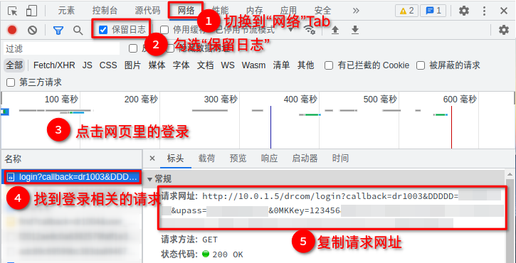

# 讲讲多拨的额外骚操作（多拨附加教程）

我的上一篇关于校园网多拨教程的全网收藏量达到1000+，感谢大家支持！这里对上一篇教程进行补充。主要包括：用脚本实现网络自动登陆、链路发生变化时LED指示灯变化和发送提醒消息。

## 一、准备工作

本篇教程用到路由器（OpenWrt固件）进行多拨，以下操作基于上一篇教程[拿什么拯救你，我的校园网——校园网优化之单线多拨](拿什么拯救你，我的校园网——校园网优化之单线多拨.md)。

## 二、校园网自动登录

网络断开或者路由器重启之后，大部分校园网会要求重新登录，这时候设置mwan3的规则再去登录是比较麻烦的。这里以校园网为例，介绍如何实现自动登录。

### 2.1 获取登录请求

#### 2.1.1 用网络日志捕获请求

登录就是向服务器发送登录请求，但是我们现在不知道这个请求长什么样，所以首先用浏览器网络日志或软件抓包来获取请求。

浏览器打开登录网页，按F12打开控制台，切换到“网络”Tab，勾选“保留日志”，回到网页里登录，找到控制台里登录（带login等字样）相关的请求，就可以找到请求的地址了。



捕获步骤

#### 2.1.2 分析登录请求

以这里的Dr认证为例，这个请求是get请求，请求里‘?’后面是以‘&’隔开的参数，比如”DDDDD”是帐号，后面登录时可能要更改一些参数，务必理解这些参数的意义，对于不确定的参数不要乱改！

#### 2.1.3 用curl发送登录请求

curl是命令行工具，用来请求Web服务器。

OpenWrt安装curl，在终端输入`curl +”刚刚复制的地址”`：

```bash
# 注：地址不一样，用自己刚刚复制的地址
curl "http://10.0.1.5/drcom/login?callback=dr1003&DDDDD=帐号&upass=密码&0
MKKey=123456"
```

回车执行，不出意外的话已经成功登录了，可以根据请求的响应和网络情况确定。

### 2.2 断网自动登录

拿到请求地址，就可以在合适的地方发送登录请求了，这里以网络断开时为例。

#### 2.2.1 找地方写登录脚本

利用mwan3的通知(notify)可以很方便地在网络连接、网络断开等时候执行脚本，就不用自己写定时触发的脚本了。通知的用法如下图：


mwan3的通知(notify)

简单来说就是联网、断网等时候会触发这个脚本，同时传入几个环境变量供脚本使用。那么我们要做的就是用curl指定传入的接口信息实现指定接口登录。

#### 2.2.2 指定接口发送请求

curl可以指定用哪个接口发送请求，只需要在命令中加入”interface”参数指定接口即可，这里用到环境变量`${DEVICE}`：

```bash
# 注：地址不一样，用自己刚刚复制的地址
curl --interface ${DEVICE} "http://10.0.1.5/drcom/login?callback=dr1003&DDDDD=帐号&upass=密码&0MKKey=123456"
```

#### 2.2.3 形成脚本

加入判断条件以及用于“翻译”命令的`eval` 形成脚本：

```bash
if [ $ACTION == disconnected ] && [ -n "$DEVICE" ]; then
	logger -p warn -t mwan3-notify "Auto login on $DEVICE..." # 记录日志
	eval "curl --interface ${DEVICE} \"http://10.0.1.5/drcom/login?callback=dr1003&DDDDD=帐号&upass=密码&0MKKey=123456\"" # curl指定接口发送请求
fi
```

点击保存，重启mwan3服务或重启路由器看是否可以在断网时自动登录。

## 三、LED管理

如果你的路由器带有LED指示灯，可以利用上面的脚本顺便控制LED的状态。OpenWrt自定义指示灯的触发器有5种：


LED配置页面

这里以“指示灯在网络通的时候监测网络活动，网络不通时常亮”为例，脚本可以像这样写：

```bash
if [ $ACTION == connected ] || [ $ACTION == disconnected ]; then
    case $INTERFACE in
        vwan0) led="system.led_internet" # 待修改：事件是在vwan0发生的，对应LED（看下一段讲解）
        ;;
        vwan1) led="system.cfg048bba" # 待修改
        ;;
        vwan2) led="system.cfg058bba" # 待修改
        ;;
        *)  logger -p warn -t mwan3-notify "There is no LED for $INTERFACE !"
            exit
        ;;
    esac
    if [ $ACTION == connected ]; then
        eval "uci set ${led}.trigger='netdev'"
        eval "uci set ${led}.dev='${DEVICE}'"
        eval "uci add_list ${led}.mode='tx'"
        uci commit
        /etc/init.d/led restart
    elif [ $ACTION == disconnected ]; then
        eval "uci del ${led}.dev"
        eval "uci del ${led}.mode"
        eval "uci set ${led}.trigger='default-on'"
        uci commit
        /etc/init.d/led restart
		fi
fi
```

其中待修改的地方已经在上方标出，vwanx 是虚拟接口名，led可以在 系统-LED配置 做修改后点右上方的更改记录看到：


配置更改记录

## 四、ntfy链路变化提醒

同样道理，也可以顺便在联网、断网时向手机等设备发送通知消息。这里用到ntfy，这是一个基于HTTP的免费开源pub-sub服务，关于其详细用法可以在官网([https://ntfy.sh/](https://ntfy.sh/))查看。


ntfy消息

ntfy几乎不用配置，通过简单的订阅和定义消息即可使用。

### 4.1 订阅主题

首先在手机或其他设备订阅主题，主题名称最好有较高的区分度：


ntfy订阅主题

### 4.2 在脚本中发送post请求

还是在上面写脚本的地方，加入并修改下面的联网通知脚本：

```bash
if [ $ACTION == disconnected ]; then
	eval "curl -H \"Tags: warning\" -H \"Title:$INTERFACE disconnected\" -d \"OpenWrt\" ntfy.sh/TODO" # 将末尾的TODO改成你订阅的主题名称
fi
```

### 4.3 测试请求

任一接口断网，手机收到提醒消息：


提醒消息

## 五、总结

这篇教程是我上一篇教程《拿什么拯救你，我的校园网——校园网优化之单线多拨》的补充教程，主要涉及OpenWrt多拨插件mwan3的自动化脚本设置。由于校园网和设备等的差异，本文仅举出了一些样例，可以根据思路进行拓展。同时如果有任何问题或者建议都可以在评论区提出，谢谢大家！